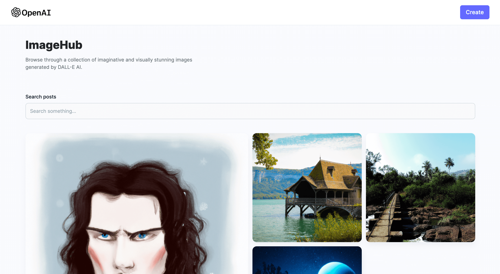

# A Full Stack MERN AI Image Generation App - MidJourney & DALL E Clone



### How to Launch

-   Create a `/server/.env` file add in the following keys.

```
MONGODB_URL
CLOUDINARY_CLOUD_NAME
CLOUDINARY_API_KEY
CLOUDINARY_API_SECRET
REACT_APP_PUBLIC_SERVER
```

-   To install dependencies, run

```
 yarn install or npm install
```

-   To launch the client app, run

```
yarn dev or npm run dev
```

-   To launch the server, run

```
yarn start  or npm start
```
